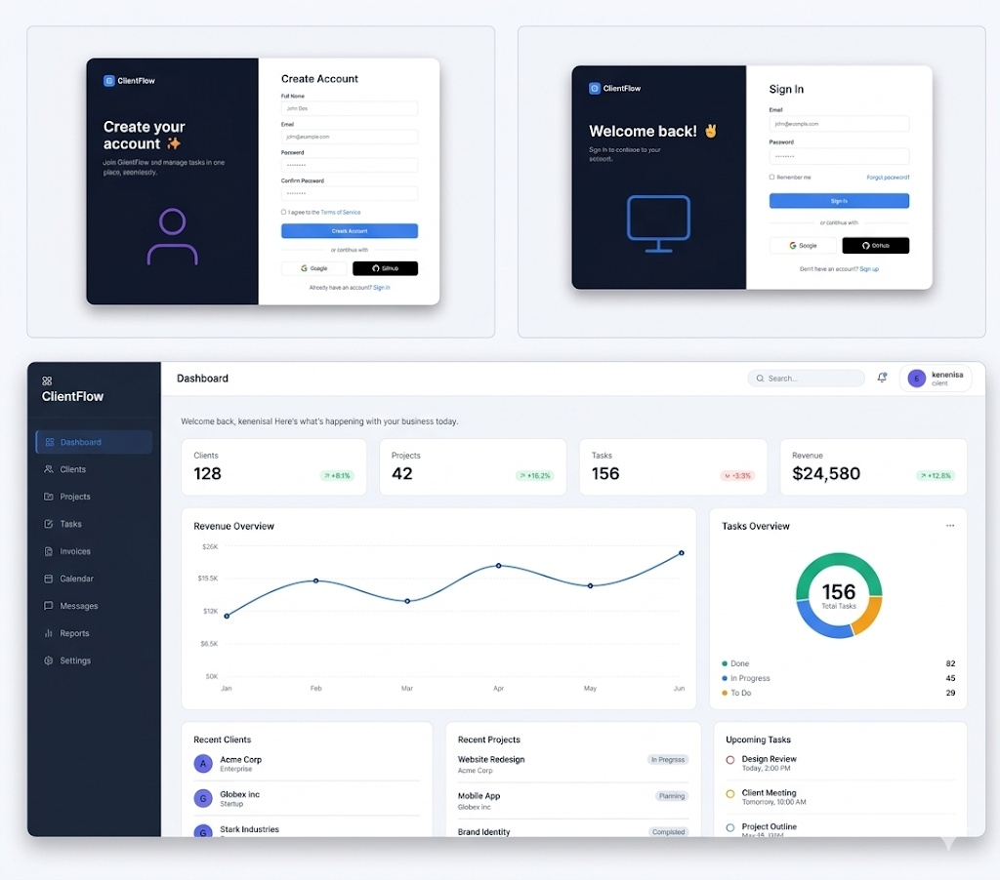

<div align="center">
  

  <h1 align="center">Kenenisa Beyan | Full-Stack Software Engineer Portfolio</h1>

  <p align="center">
    A premium, high-performance portfolio application architected with React, TypeScript, Three.js, and Node.js.
    <br />
    <a href="https://kenenisabeyan.github.io/myPortfolio-final"><strong>View Live Demo »</strong></a>
    <br />
    <br />
    <a href="https://github.com/kenenisabeyan">GitHub</a>
    ·
    <a href="https://www.linkedin.com/in/kenenisa/">LinkedIn</a>
    ·
    <a href="mailto:kenenisab05@gmail.com">Contact Me</a>
  </p>

  <p align="center">
    
    
    
    
    
  </p>
</div>

---

## ⚡ Executive Summary

This repository contains the source code for my professional developer portfolio. Engineered to be more than just a digital resume, this application serves as a live, interactive demonstration of my ability to architect and deploy modern, enterprise-grade digital solutions. 

By seamlessly blending **cutting-edge WebGL 3D graphics** on the frontend with a **secure, decoupled backend**, this project highlights my commitment to producing software that is aesthetically striking, highly performant, and structurally robust.

## 🚀 Key Features & Capabilities

- **Immersive 3D Environments:** Utilizes `Three.js` and `React Three Fiber` to render dynamic, interactive 3D particle systems and geometry directly in the browser, creating a "wow factor" without compromising rendering performance.
- **Modern UI/UX Engineering:** Built with `Tailwind CSS`, featuring complex styling techniques including glassmorphism (backdrop-blur), CSS gradients, infinite scroll marquees, and dynamic hover micro-interactions.
- **Scroll-Spy Navigation:** A custom-built, fixed navigation system that intelligently tracks the user's viewport position and updates the active section states in real-time.
- **Flawless Mobile Responsiveness:** Extensively tested across all viewports. Includes advanced mobile specific logic such as `body` scroll-locking when the mobile menu is active, and smart resizing listeners to prevent layout shifts.
- **Secure Full-Stack Architecture:** Unlike static portfolios, this site runs a dedicated Node.js/Express backend API. It safely handles cross-origin HTTP POST requests and securely bridges client inquiries to a NodeMailer email service, completely hiding sensitive SMTP credentials from the client-side.

## 💻 Technology Stack

### Frontend Architecture
- **Framework:** React.js (v19) powered by Vite for lightning-fast HMR and optimized builds.
- **Language:** TypeScript for strict type-safety, interface definitions, and scalable codebase management.
- **Styling:** Tailwind CSS for utility-first, highly maintainable responsive styling.
- **Graphics/Animation:** `@react-three/fiber`, `@react-three/drei`, and `Three.js` for GPU-accelerated WebGL rendering. `framer-motion` concepts integrated via raw CSS for performance.

### Backend Architecture
- **Runtime:** Node.js
- **Framework:** Express.js for REST API routing and middleware management.
- **Communication:** `Nodemailer` for SMTP email dispatch.
- **Security:** `cors` for Cross-Origin Resource Sharing rules and `dotenv` for environment variable injection.

## 🏗️ Project Structure

The project utilizes a decoupled monorepo approach for clear separation of concerns:

```bash
myPortfolio-final/
├── frontend/               # React/Vite Client Application
│   ├── src/
│   │   ├── assets/         # Optimized images, icons, and PDF resumes
│   │   ├── components/     # Modular, reusable React components (Hero, Navbar, Contact)
│   │   ├── data/           # Structured JSON/JS data for Projects and Skills
│   │   ├── index.css       # Global Tailwind directives and custom animations
│   │   └── main.tsx        # React DOM entry point
│   └── package.json        # Frontend dependencies
│
├── backend/                # Node.js API Server
│   ├── server.js           # Express server and Nodemailer transport logic
│   ├── .env                # Secure SMTP credentials (git-ignored)
│   └── package.json        # Backend dependencies
│
└── .gitignore              # Global git ignore rules
```

## ⚙️ Local Development Setup

To run this application locally, you will need `Node.js` (v18+) installed.

### 1. Clone the repository
```bash
git clone https://github.com/kenenisabeyan/myPortfolio-final.git
cd myPortfolio-final
```

### 2. Setup the Backend API
```bash
cd backend
npm install
```
Create a `.env` file in the `backend` directory with your Google App Password:
```env
EMAIL_USER=your_email@gmail.com
EMAIL_PASS=your_app_password
```
Start the backend server:
```bash
npm run dev
# Server will run on http://localhost:5001
```

### 3. Setup the Frontend Client
Open a new terminal window:
```bash
cd frontend
npm install
npm run dev
# Vite will start the client on http://localhost:5173
```

## 📬 Contact & Collaboration

I am currently open to new opportunities, freelance projects, and collaborations. If you are looking for a software engineer who values clean code, innovative design, and robust architecture, let's connect.

- **Email:** [kenenisab05@gmail.com](mailto:kenenisab05@gmail.com)
- **LinkedIn:** [Kenenisa Beyan](https://www.linkedin.com/in/kenenisa/)
- **GitHub:** [@kenenisabeyan](https://github.com/kenenisabeyan)

---
<div align="center">
  <sub>Built with ❤️ by Kenenisa Beyan. © 2026 All Rights Reserved.</sub>
</div>
